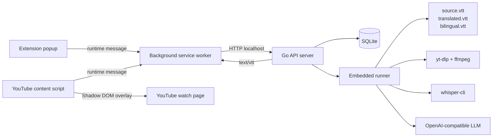

# Lets Sub It

<div align="center">

**本地优先的 YouTube 字幕生成与翻译工具**


[功能](#功能) • [快速开始](#快速开始) • [架构](#架构) • [API](#api) • [开发](#开发) • [排障](#排障)

</div>

Lets Sub It 是一个自托管字幕工作台：提交一个公开 YouTube 视频链接，后端下载音频、用本地 Whisper 转写、调用 OpenAI-compatible LLM 翻译，然后由 Chrome 扩展把字幕渲染到 YouTube 播放页。

> [!IMPORTANT]
> 这是一个 MVP 项目，但后端运行的是真实处理链路。首次处理视频可能下载 Whisper 模型、调用外部 LLM，并产生真实费用或较长等待时间。

## 功能

- **端到端字幕生成**：公开视频 URL -> 音频下载 -> Whisper 转写 -> LLM 翻译 -> WebVTT 字幕文件。
- **本地自托管**：SQLite 数据库、任务文件和模型缓存保存在本机或 Docker volume 中。
- **任务复用**：同一 `videoId + targetLanguage` 会复用已完成结果或进行中的任务。
- **YouTube 页面集成**：Chrome 扩展在 watch 页面显示翻译字幕，并支持 `translated` 和 `bilingual` 两种模式。
- **明确安全边界**：扩展只访问本机后端，不保存 provider key；API 不返回服务端本地绝对路径。

## 项目组成

| 模块 | 技术栈 | 作用 |
| --- | --- | --- |
| `backend/` | Go 1.22, SQLite, GORM | HTTP API、任务复用、状态持久化、真实 runner、VTT 文件服务 |
| `whisper/` | Python 3.12, `faster-whisper`, `uv` | `whisper-cli`：输入本地音频，输出经过校验的 WebVTT |
| `extension/` | WXT, Vue, TypeScript, Vitest | Chrome MV3 popup、background API 网关、YouTube 播放页字幕层 |
| `docs/` | Markdown, Diátaxis | 教程、操作指南、参考资料和架构解释 |

## 快速开始

最短路径是用 Docker 跑后端，再用 WXT 启动扩展开发构建。

### 1. 启动后端

```bash
cp .env.example .env
# 编辑 .env，至少填写 LSI_LLM_API_KEY 和 LSI_LLM_MODEL
docker compose up -d
```

Docker 后端镜像包含 Go server、Python `whisper-cli`、`yt-dlp` 和 `ffmpeg`。默认只绑定 `127.0.0.1:8080`。

> [!WARNING]
> 后端没有登录、鉴权、多租户或公网部署保护。不要把它直接暴露到公网；确需局域网访问时，再把 `.env` 中的 `LSI_DOCKER_BIND_HOST` 改为 `0.0.0.0`。

查看或停止后端：

```bash
docker compose logs -f
docker compose down
```

### 2. 启动扩展

```bash
cd extension
mise exec -- npm install
mise exec -- npm run dev
```

在 Chrome 扩展开发者模式中加载：

```text
extension/.output/chrome-mv3
```

popup 默认连接 `http://127.0.0.1:8080`。当前只允许带端口的本机 HTTP origin，例如 `http://localhost:8080` 或 `http://127.0.0.1:8080`。

### 3. 创建字幕任务

打开一个 YouTube watch 页面，点击扩展 popup，确认 backend URL、源语言和目标语言，然后提交任务。任务完成后，字幕会写入扩展缓存并显示在当前 YouTube 页面。

也可以直接用 API 做 smoke test：

```bash
curl -X POST "http://127.0.0.1:8080/jobs" \
  -H "Content-Type: application/json" \
  -d '{
    "youtubeUrl": "https://www.youtube.com/watch?v=dQw4w9WgXcQ",
    "sourceLanguage": "en",
    "targetLanguage": "zh"
  }'
```

## 本地开发运行

本地真实后端需要 `yt-dlp`、`ffmpeg` 和 `whisper-cli` 都在 `PATH` 中。项目工具链由 `mise.toml` 固定：

```bash
mise install
```

从仓库根目录安装各模块依赖：

```bash
(cd backend && mise exec -- go mod download)
(cd whisper && mise exec -- uv sync --dev)
(cd extension && mise exec -- npm install)
```

从仓库根目录启动本地后端：

```bash
(cd backend && \
  PATH="$PWD/../whisper/.venv/bin:$PATH" \
  LSI_DOWNLOAD_TIMEOUT=10m \
  LSI_WHISPER_MODEL=small \
  LSI_WHISPER_COMPUTE_TYPE=int8 \
  LSI_LLM_BASE_URL=https://api.openai.com \
  LSI_LLM_API_KEY="$OPENAI_API_KEY" \
  LSI_LLM_MODEL=gpt-4.1-mini \
  LSI_LLM_TIMEOUT=2m \
  LSI_LOG_LEVEL=info \
  LSI_ADDR=127.0.0.1:8080 \
  mise exec -- go run ./cmd/server)
```

单独运行 `whisper-cli`：

```bash
cd whisper
mise exec -- uv run whisper-cli \
  --input /path/to/audio.mp3 \
  --output /tmp/source.vtt \
  --model small \
  --compute-type int8 \
  --language ja
```

## 架构



任务状态流：

```text
queued -> downloading -> transcribing -> translating -> packaging -> completed
```

失败时状态为 `failed`，`errorMessage` 会包含错误摘要。

## 处理链路

| 阶段 | 执行者 | 产物或效果 |
| --- | --- | --- |
| `downloading` | `yt-dlp` + `ffmpeg` | 下载并转码音频 |
| `transcribing` | `whisper-cli` | 生成 `source.vtt` |
| `translating` | OpenAI-compatible LLM | 生成翻译文本并写入 `translated.vtt` |
| `packaging` | Go backend | 生成 `bilingual.vtt` 并登记字幕资产 |

扩展不会直接调用 Go 后端。popup 和 content script 都通过 background service worker 发送 runtime message，由 background 统一处理 HTTP 请求、字幕文件读取和缓存。

## API

| 方法 | 路径 | 说明 |
| --- | --- | --- |
| `POST` | `/jobs` | 创建或复用字幕生成任务 |
| `GET` | `/jobs/:id` | 查询任务状态 |
| `GET` | `/jobs/active?videoId=...&targetLanguage=...` | 查询指定视频和目标语言最近的任务 |
| `GET` | `/subtitle-assets?videoId=...&targetLanguage=...` | 查询已完成字幕资产 |
| `GET` | `/subtitle-files/:jobId/:mode` | 读取 VTT 文件，`mode` 为 `source`、`translated` 或 `bilingual` |

`POST /jobs` 请求示例：

```json
{
  "youtubeUrl": "https://www.youtube.com/watch?v=dQw4w9WgXcQ",
  "sourceLanguage": "en",
  "targetLanguage": "zh"
}
```

## 配置

| 环境变量 | 默认值 | 说明 |
| --- | --- | --- |
| `LSI_ADDR` | `127.0.0.1:8080` | HTTP 监听地址；Docker 容器内监听 `0.0.0.0:8080` |
| `LSI_DB_PATH` | `./data/backend.sqlite3` | SQLite 数据库路径 |
| `LSI_WORK_DIR` | `./data/jobs` | job 工作目录根路径 |
| `LSI_LOG_LEVEL` | `info` | 结构化日志级别：`debug`、`info`、`warn` 或 `error` |
| `LSI_DOWNLOAD_TIMEOUT` | `10m` | 下载阶段超时 |
| `LSI_WHISPER_MODEL` | `small` | 传给 `whisper-cli --model` 的模型名或本地 CTranslate2 模型目录 |
| `LSI_WHISPER_COMPUTE_TYPE` | `default` | 传给 `whisper-cli --compute-type` 的 faster-whisper compute type |
| `HF_TOKEN` | 空 | 可选 Hugging Face token，用于提高模型下载限额 |
| `LSI_LLM_BASE_URL` | `https://api.openai.com` | OpenAI-compatible API origin |
| `LSI_LLM_API_KEY` | 空 | OpenAI 默认 endpoint 必填；仅后端读取 |
| `LSI_LLM_MODEL` | 空 | 翻译模型名 |
| `LSI_LLM_TIMEOUT` | `2m` | 单段翻译请求超时 |

Docker 数据默认持久化在两个 named volume 中：`lsi-data` 保存 SQLite 和 job 文件，`lsi-hf-cache` 保存 Hugging Face/Whisper 模型缓存。

## 开发

运行全部测试：

```bash
(cd backend && mise exec -- go test ./...)
(cd whisper && mise exec -- uv run pytest)
(cd extension && mise exec -- npm run test)
```

常用聚焦命令：

```bash
(cd backend && mise exec -- go test ./internal/api)
(cd whisper && mise exec -- uv run pytest tests/test_vtt.py)
(cd extension && mise exec -- npx vitest run src/api/backend-client.test.ts)
(cd extension && mise exec -- npm run typecheck)
```

构建验证：

```bash
(cd backend && mise exec -- go build ./...)
(cd whisper && mise exec -- uv build)
(cd extension && mise exec -- npm run build)
```

> [!TIP]
> 仓库根目录也提供 `Taskfile.yml`。如果已安装 `go-task`，可以用 `mise exec -- task --list` 查看聚合任务。

## 当前限制

- 只支持 YouTube 公开视频，不支持私有视频、登录态、cookie 导入或授权绕过。
- Chrome 扩展 MVP 只支持 `en` 和 `zh`，且 `sourceLanguage` 必须不等于 `targetLanguage`。
- 扩展只允许连接 `localhost` 或 `127.0.0.1` 的带端口 HTTP origin。
- 后端服务重启后不会自动恢复进行中的 runner；卡住的旧 job 需要手动清理或标记失败后再重新创建。
- LLM 翻译链路暂无并发控制或成本统计。
- 单元测试必须保持离线可重复，不应触发真实 YouTube、模型下载、GPU 或外部 LLM。

## 排障

| 问题 | 检查项 |
| --- | --- |
| 后端启动失败并提示工具缺失 | 确认 `yt-dlp`、`ffmpeg` 和 `whisper-cli` 在 `PATH` 中；Docker 后端已内置这些工具 |
| job 在 `translating` 阶段失败 | 确认 `LSI_LLM_BASE_URL`、`LSI_LLM_MODEL` 已配置；OpenAI 默认 endpoint 还需要 `LSI_LLM_API_KEY` |
| 扩展无法连接后端 | backend URL 必须是 `http://localhost:<port>` 或 `http://127.0.0.1:<port>`，不能带路径、查询参数或 HTTPS |
| Whisper 首次运行很慢 | 真实转写可能触发模型下载；模型会缓存在本机或 Docker volume 中 |
| 字幕文件返回 404 | 确认任务已完成，且 `mode` 是 `source`、`translated` 或 `bilingual` |

## 文档

- [文档入口](docs/README.md)
- [本地开发](docs/how-to/local-development.md)
- [Docker 部署](docs/how-to/docker-deployment.md)
- [测试与构建验证](docs/how-to/testing.md)
- [后端 API](docs/reference/backend-api.md)
- [后端配置](docs/reference/backend-config.md)
- [Whisper CLI](docs/reference/whisper-cli.md)
- [架构总览](docs/explanation/architecture-overview.md)
- [安全与隐私](docs/explanation/security-and-privacy.md)
