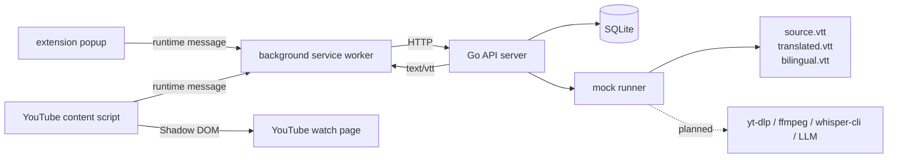

# Lets Sub It

<!-- prettier-ignore -->
<div align="center">

**自托管的 YouTube 字幕生成与翻译工具**


[功能](#功能) • [快速开始](#快速开始) • [架构](#架构) • [API](#api) • [开发](#开发)

</div>

Lets Sub It 的目标是把“提交 YouTube 公开视频链接 -> 下载音频 -> 本地转写 -> 翻译 -> 生成字幕 -> 播放页加载”这条链路做得简单、可控、容易排障。

> [!NOTE]
> 项目处于 MVP 阶段。当前仓库已经可以本地运行 `backend/` mock API server、`whisper/` 本地转写 CLI，以及 `extension/` Chrome MV3 前端工程。真实 `yt-dlp` 下载、`ffmpeg` 音频处理、后端调用 `whisper-cli` 和 LLM 翻译仍在后续迭代中。

## 功能

- **自托管优先**：面向单用户本地部署，SQLite 数据库、任务目录和字幕文件都保存在本机。
- **完整 API 边界**：Go backend 提供 job 创建、状态查询、结果复用、字幕资产查询和 VTT 文件服务。
- **可联调 mock runner**：当前 backend 不访问 YouTube、不调用 LLM，但会推进完整状态流并生成 `source.vtt`、`translated.vtt`、`bilingual.vtt`。
- **真实转写 CLI**：`whisper-cli` 基于 `faster-whisper`，把本地音频文件转为经过校验的 WebVTT。
- **Chrome 播放页集成**：extension 支持 popup 创建任务、background 统一访问 backend、YouTube watch 页面字幕层渲染与模式切换。

## 当前状态

| 模块 | 技术栈 | 当前能力 |
| --- | --- | --- |
| `backend/` | Go 1.22, SQLite, GORM | 真实 HTTP API、持久化、job 复用、mock runner、VTT 文件服务 |
| `whisper/` | Python 3.12, `faster-whisper`, `uv` | 本地音频转写、WebVTT 渲染、CLI JSON 输出和退出码契约 |
| `extension/` | WXT, Vue, TypeScript, Vitest | Chrome MV3 popup、background API 网关、storage 缓存、YouTube 字幕层 |
| `docs/` | Markdown | PRD、规格说明和实施计划 |

> [!IMPORTANT]
> 现在的 backend 是“真实 API + 真实持久化 + mock runner”，不是完整生产链路。单元测试不依赖网络、真实 YouTube、模型下载、本地 GPU 或外部 LLM API。

## 快速开始

### 1. 准备工具链

项目使用 `mise.toml` 固定本地工具版本：

- Go `1.22`
- Python `3.12`
- Node.js `22`
- `uv`

```bash
mise install
```

> [!TIP]
> 如果 shell 没有自动激活 `mise`，请通过 `mise exec --` 运行项目命令。下面的示例都使用这个形式。

### 2. 启动 mock API server

```bash
cd backend
mise exec -- go mod download
LSI_ADDR=127.0.0.1:8080 mise exec -- go run ./cmd/server
```

另开一个终端快速创建 job：

```bash
curl -X POST "http://127.0.0.1:8080/jobs" \
  -H "Content-Type: application/json" \
  -d '{
    "youtubeUrl": "https://www.youtube.com/watch?v=dQw4w9WgXcQ",
    "sourceLanguage": "en",
    "targetLanguage": "zh-CN"
  }'
```

创建成功后，mock runner 会推进状态并在 `LSI_WORK_DIR` 下生成三种 VTT 文件。

### 3. 运行 Chrome extension

```bash
cd extension
mise exec -- npm install
mise exec -- npm run dev
```

在 Chrome 的 extension developer mode 中加载 WXT 生成的 `.output/chrome-mv3` 目录。popup 默认连接 `http://127.0.0.1:8080`，第一版只支持 `localhost` 和 `127.0.0.1` backend URL。

### 4. 运行本地转写 CLI

```bash
cd whisper
mise exec -- uv sync --dev
mise exec -- uv run whisper-cli \
  --input /path/to/audio.mp3 \
  --output /tmp/source.vtt \
  --model small \
  --language ja
```

成功时 stdout 输出 JSON，`--output` 写入 WebVTT：

```json
{
  "output": "/tmp/source.vtt",
  "language": "ja",
  "duration_seconds": 123.45,
  "segments": 42
}
```

真实转写可能需要下载 Whisper 模型，并依赖本机可用的推理运行环境。

## 架构



状态流转：

```text
queued -> downloading -> transcribing -> translating -> packaging -> completed
```

失败时状态为 `failed`，响应中的 `errorMessage` 会记录错误摘要。

## API

当前 backend 暴露本地联调用的 mock API：

| 方法 | 路径 | 说明 |
| --- | --- | --- |
| `POST` | `/jobs` | 创建或复用字幕生成 job |
| `GET` | `/jobs/:id` | 查询 job 状态 |
| `GET` | `/subtitle-assets?videoId=...&targetLanguage=...` | 查询已完成字幕资产 |
| `GET` | `/subtitle-files/:jobId/:mode` | 读取 VTT 文件，`mode` 为 `source`、`translated` 或 `bilingual` |

主要配置：

| 环境变量 | 默认值 | 说明 |
| --- | --- | --- |
| `LSI_ADDR` | `127.0.0.1:8080` | HTTP 监听地址 |
| `LSI_DB_PATH` | `./data/backend.sqlite3` | SQLite 数据库路径 |
| `LSI_WORK_DIR` | `./data/jobs` | job 工作目录根路径 |

## CLI 契约

`whisper-cli` 输入本地音频文件，输出合法 WebVTT。

```bash
whisper-cli \
  --input /path/to/audio.mp3 \
  --output /tmp/source.vtt \
  --model small \
  --language ja
```

| 参数 | 必填 | 说明 |
| --- | --- | --- |
| `--input` | 是 | 本地音频文件路径 |
| `--output` | 是 | 输出 `.vtt` 路径，不能与输入路径相同 |
| `--model` | 是 | `faster-whisper` 模型名，例如 `small` |
| `--language` | 是 | 转写语言代码，例如 `ja`、`en` |

退出码：

| 退出码 | 含义 |
| --- | --- |
| `0` | 成功 |
| `2` | 输入校验失败，例如文件不存在、模型名或语言无效 |
| `3` | 转写失败 |
| `4` | 输出校验失败，例如无法生成合法 VTT |

## 仓库结构

```text
.
├── backend/                 # Go mock API server
│   ├── cmd/server/          # HTTP server 入口
│   └── internal/            # API、store、runner、app 代码
├── docs/                    # PRD、规格说明和实施计划
├── extension/               # Chrome MV3 extension
│   ├── entrypoints/         # popup、background、content script 入口
│   └── src/                 # API、storage、subtitle、YouTube 集成和 UI 代码
├── whisper/                 # Python faster-whisper CLI
│   ├── src/whisper_cli/     # CLI、转写适配和 VTT 渲染
│   └── tests/               # pytest 单元测试
└── mise.toml                # 本地工具链版本
```

## 开发

安装依赖：

```bash
cd backend && mise exec -- go mod download
cd ../whisper && mise exec -- uv sync --dev
cd ../extension && mise exec -- npm install
```

运行测试：

```bash
cd backend && mise exec -- go test ./...
cd ../whisper && mise exec -- uv run pytest
cd ../extension && mise exec -- npm run test
```

构建验证：

```bash
cd backend && mise exec -- go build ./...
cd ../whisper && mise exec -- uv build
cd ../extension && mise exec -- npm run build
```

## 限制与路线图

- [x] `whisper-cli` 本地转写命令、WebVTT 渲染和退出码契约
- [x] Go mock API server、SQLite、job 复用、状态机和字幕文件服务
- [x] Chrome extension 任务提交、状态轮询、字幕缓存和播放页字幕层
- [ ] 真实 `yt-dlp` 下载与 `ffmpeg` 音频处理
- [ ] 后端 embedded runner 调用真实 `whisper-cli`
- [ ] OpenAI-compatible LLM 翻译链路
- [ ] 基于真实字幕的 `translated.vtt` 与 `bilingual.vtt` 打包

当前不支持私有视频、登录态、远程 backend URL、多用户系统、鉴权、批量任务或完整语言列表。extension 第一版只提供 `en` 和 `zh-CN` 互相转换。

## 相关文档

- [PRD](docs/PRD.md)
- [Backend README](backend/README.md)
- [Whisper README](whisper/README.md)
- [Extension README](extension/README.md)
- [Whisper CLI 设计说明](docs/superpowers/specs/2026-04-23-whisper-cli-design.md)
- [Backend Mock MVP 设计](docs/superpowers/specs/2026-04-24-backend-mock-mvp-design.md)
- [Extension MVP 设计](docs/superpowers/specs/2026-04-25-extension-mvp-design.md)
