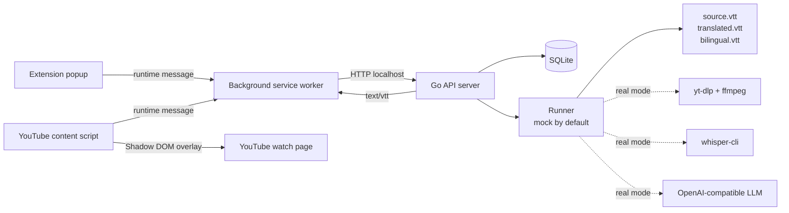

# Lets Sub It

<div align="center">

**自托管 YouTube 字幕生成与翻译工具**


[概览](#概览) &bull; [快速开始](#快速开始) &bull; [真实模式](#真实模式) &bull; [架构](#架构) &bull; [API](#api) &bull; [开发](#开发)

</div>

Lets Sub It 是一个本地优先的字幕工作台。你提交一个 YouTube 公开视频链接，后端下载音频、调用本地 Whisper 转写、用 OpenAI-compatible LLM 翻译，再把字幕交给 Chrome 扩展显示在 YouTube 播放页上。

> [!IMPORTANT]
> 项目仍处于 MVP 阶段。默认后端使用 `mock` runner，不访问 YouTube、不下载模型、也不调用 LLM。启用 `LSI_RUNNER_MODE=real` 才会运行真实下载、转写和翻译链路。

## 概览

| 模块 | 技术栈 | 作用 |
| --- | --- | --- |
| `backend/` | Go 1.22, SQLite, GORM | HTTP API、任务复用、状态持久化、mock/real runner、VTT 文件服务 |
| `whisper/` | Python 3.12, `faster-whisper`, `uv` | `whisper-cli`：输入本地音频，输出经过校验的 WebVTT |
| `extension/` | WXT, Vue, TypeScript, Vitest | Chrome MV3 popup、background API 网关、YouTube 播放页字幕层 |

核心能力：

- **本机自托管**：SQLite 数据库、任务文件和模型缓存都保存在本机或 Docker volume 中。
- **端到端字幕链路**：公开视频 URL -> 音频下载 -> Whisper 转写 -> LLM 翻译 -> `translated.vtt` / `bilingual.vtt`。
- **任务复用**：同一 `videoId + targetLanguage` 会复用已完成结果或进行中的任务。
- **播放页集成**：Chrome 扩展在 YouTube watch 页面显示翻译字幕，并支持 `translated` 和 `bilingual` 模式切换。
- **安全的文件服务**：API 只暴露 `/subtitle-files/:jobId/:mode`，不会把本地绝对路径返回给扩展。

## 快速开始

你可以用 Docker 一键启动真实后端，也可以用本地工具链启动 mock 后端做开发。

### 方式一：Docker 后端（真实模式）

Docker 镜像包含 Go 后端、Python `whisper-cli`、`yt-dlp` 和 `ffmpeg`，适合直接跑真实字幕生成链路。

```bash
cp .env.example .env
# 编辑 .env，至少填写 LSI_LLM_API_KEY 和 LSI_LLM_MODEL
docker compose up -d
```

常用命令：

```bash
docker compose logs -f
docker compose down
```

Docker 默认只绑定 `127.0.0.1:8080`。如需让局域网设备访问，可把 `.env` 中的 `LSI_DOCKER_BIND_HOST` 改为 `0.0.0.0`。

SQLite 数据库、任务文件和 Whisper 模型缓存会持久化在 Docker named volume `lsi-data` 中。

> [!WARNING]
> 本项目面向单用户本地自托管，没有登录、鉴权、多租户或公网部署保护。不要把服务直接暴露到公网。

### 方式二：本地 mock 后端

本地开发使用 `mise` 固定 Go、Python、Node.js 和 `uv` 版本：

```bash
mise install
```

启动后端 mock API：

```bash
cd backend
mise exec -- go mod download
LSI_ADDR=127.0.0.1:8080 mise exec -- go run ./cmd/server
```

另开终端提交一个任务：

```bash
curl -X POST "http://127.0.0.1:8080/jobs" \
  -H "Content-Type: application/json" \
  -d '{
    "youtubeUrl": "https://www.youtube.com/watch?v=dQw4w9WgXcQ",
    "sourceLanguage": "en",
    "targetLanguage": "zh"
  }'
```

mock runner 会模拟完整状态流，并在 `LSI_WORK_DIR` 下生成 `source.vtt`、`translated.vtt` 和 `bilingual.vtt`。

### 安装 Chrome 扩展

```bash
cd extension
mise exec -- npm install
mise exec -- npm run dev
```

然后在 Chrome extension developer mode 中加载：

```text
extension/.output/chrome-mv3
```

popup 默认连接 `http://127.0.0.1:8080`。当前只允许带端口的本机 HTTP origin，例如 `http://localhost:8080` 或 `http://127.0.0.1:8080`。

## 真实模式

`LSI_RUNNER_MODE=real` 会让后端调用真实工具链：

| 阶段 | 工具 |
| --- | --- |
| `downloading` | `yt-dlp` + `ffmpeg` 下载并转码音频 |
| `transcribing` | PATH 中的 `whisper-cli` 生成 `source.vtt` |
| `translating` | Chat Completions 兼容 LLM 生成翻译文本 |
| `packaging` | 后端生成 `translated.vtt` 和 `bilingual.vtt` |

本地 real runner 示例：

```bash
cd whisper && mise exec -- uv sync --dev && cd ../backend

PATH="$PWD/../whisper/.venv/bin:$PATH" \
LSI_RUNNER_MODE=real \
LSI_DOWNLOAD_TIMEOUT=10m \
LSI_WHISPER_MODEL=small \
LSI_LLM_BASE_URL=https://api.openai.com \
LSI_LLM_API_KEY="$OPENAI_API_KEY" \
LSI_LLM_MODEL=gpt-4.1-mini \
LSI_LLM_TIMEOUT=2m \
LSI_ADDR=127.0.0.1:8080 \
mise exec -- go run ./cmd/server
```

> [!TIP]
> real runner 需要本机已安装 `yt-dlp` 和 `ffmpeg`。如果使用 Docker 后端，这些工具已经在镜像中。

## 架构



任务状态流：

```text
queued -> downloading -> transcribing -> translating -> packaging -> completed
```

失败时状态为 `failed`，API 响应中的 `errorMessage` 会包含错误摘要。

## API

| 方法 | 路径 | 说明 |
| --- | --- | --- |
| `POST` | `/jobs` | 创建或复用字幕生成任务 |
| `GET` | `/jobs/:id` | 查询任务状态 |
| `GET` | `/subtitle-assets?videoId=...&targetLanguage=...` | 查询已完成字幕资产 |
| `GET` | `/subtitle-files/:jobId/:mode` | 读取 VTT 文件，`mode` 为 `source`、`translated` 或 `bilingual` |

创建任务请求：

```json
{
  "youtubeUrl": "https://www.youtube.com/watch?v=dQw4w9WgXcQ",
  "sourceLanguage": "en",
  "targetLanguage": "zh"
}
```

### 后端配置

| 环境变量 | 默认值 | 说明 |
| --- | --- | --- |
| `LSI_ADDR` | `127.0.0.1:8080` | HTTP 监听地址；Docker 容器内默认为 `0.0.0.0:8080` |
| `LSI_DB_PATH` | `./data/backend.sqlite3` | SQLite 数据库路径 |
| `LSI_WORK_DIR` | `./data/jobs` | job 工作目录根路径 |
| `LSI_RUNNER_MODE` | `mock` | runner 模式：`mock` 或 `real` |
| `LSI_DOWNLOAD_TIMEOUT` | `10m` | real 模式下单次下载超时 |
| `LSI_WHISPER_MODEL` | `small` | 传给 `whisper-cli --model` 的模型名 |
| `LSI_LLM_BASE_URL` | `https://api.openai.com` | OpenAI-compatible API origin |
| `LSI_LLM_API_KEY` | 空 | OpenAI 默认 endpoint 必填；仅后端读取 |
| `LSI_LLM_MODEL` | 空 | real 模式下翻译必填的模型名 |
| `LSI_LLM_TIMEOUT` | `2m` | 单条 cue 翻译请求超时 |

### Whisper CLI

`whisper-cli` 输入本地音频文件，输出合法 WebVTT，并在成功时向 stdout 写入 JSON 摘要。

```bash
cd whisper
mise exec -- uv sync --dev
mise exec -- uv run whisper-cli \
  --input /path/to/audio.mp3 \
  --output /tmp/source.vtt \
  --model small \
  --language ja
```

退出码：

| 退出码 | 含义 |
| --- | --- |
| `0` | 成功 |
| `2` | 输入校验失败 |
| `3` | 转写失败 |
| `4` | 输出校验失败 |

## 仓库结构

```text
.
├── backend/                 # Go API server
│   ├── cmd/server/          # HTTP server 入口
│   └── internal/            # api、app、runner、store
├── whisper/                 # Python faster-whisper CLI
│   ├── src/whisper_cli/     # CLI、转写适配、VTT 校验和渲染
│   └── tests/               # pytest 单元测试
├── extension/               # Chrome MV3 extension
│   ├── entrypoints/         # popup、background、content script
│   └── src/                 # API、storage、subtitle、YouTube 集成和 UI
├── docs/                    # PRD、规格说明和实施计划
├── docker-compose.yml       # 后端 Docker 部署
└── mise.toml                # 本地工具链版本
```

## 开发

安装依赖：

```bash
cd backend && mise exec -- go mod download
cd ../whisper && mise exec -- uv sync --dev
cd ../extension && mise exec -- npm install
```

运行测试：

```bash
cd backend && mise exec -- go test ./...
cd ../whisper && mise exec -- uv run pytest
cd ../extension && mise exec -- npm run test
```

构建验证：

```bash
cd backend && mise exec -- go build ./...
cd ../whisper && mise exec -- uv build
cd ../extension && mise exec -- npm run build
```

## 当前限制

- 只支持 YouTube 公开视频，不支持私有视频、登录态、cookie 导入或授权绕过。
- Chrome 扩展 MVP 只支持 `en` 和 `zh`，且源语言与目标语言不能相同。
- 扩展只允许连接 `localhost` 或 `127.0.0.1` 后端 URL。
- real runner 的 LLM 翻译链路暂无请求重试、并发控制或成本统计。
- 后端没有用户系统，不能当作生产级公网服务使用。

## 排障

| 问题 | 检查项 |
| --- | --- |
| `LSI_RUNNER_MODE=real` 启动失败 | 确认 `yt-dlp`、`ffmpeg` 和 `whisper-cli` 在 `PATH` 中 |
| job 在 `translating` 阶段失败 | 确认 `LSI_LLM_BASE_URL`、`LSI_LLM_MODEL` 已配置；OpenAI 默认 endpoint 还需要 `LSI_LLM_API_KEY` |
| 扩展无法连接后端 | 确认 backend URL 是带端口的本机 HTTP origin，且不包含路径或查询参数 |
| Whisper 首次运行很慢 | real 模式可能触发模型下载；单元测试不会下载模型或依赖 GPU |
| 字幕文件返回 404 | 确认任务已完成，且 `mode` 是 `source`、`translated` 或 `bilingual` |

## 相关文档

- [PRD](docs/PRD.md)
- [Backend README](backend/README.md)
- [Whisper README](whisper/README.md)
- [Extension README](extension/README.md)
- [Whisper CLI 设计说明](docs/superpowers/specs/2026-04-23-whisper-cli-design.md)
- [Backend Mock MVP 设计](docs/superpowers/specs/2026-04-24-backend-mock-mvp-design.md)
- [Extension MVP 设计](docs/superpowers/specs/2026-04-25-extension-mvp-design.md)
- [真实音频下载设计](docs/superpowers/specs/2026-04-27-real-audio-download-design.md)
- [Docker 部署设计](docs/superpowers/specs/2026-05-02-docker-deployment-design.md)
