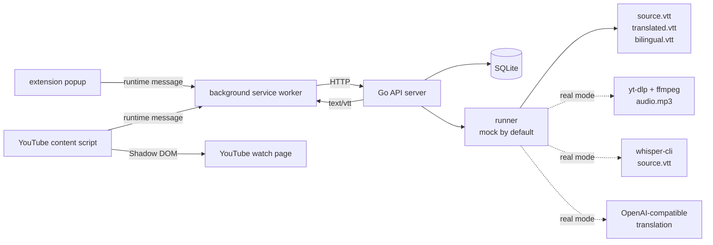

# Lets Sub It

<div align="center">

**自托管 YouTube 字幕生成与翻译工具**


[概览](#概览) &bull; [快速开始](#快速开始) &bull; [真实模式](#真实模式) &bull; [架构](#架构) &bull; [API](#api) &bull; [开发](#开发与验证)

</div>

---

Lets Sub It 是一个本地优先的字幕工作台：提交 YouTube 公开视频链接，后端创建字幕任务，下载音频、转写、翻译并打包字幕，Chrome extension 再在 YouTube 播放页加载翻译字幕。

> [!IMPORTANT]
> 项目仍处于 MVP 阶段。默认 backend 使用 mock runner，不访问 YouTube、Whisper 模型或 LLM。设置 `LSI_RUNNER_MODE=real` 后会调用真实工具链——详见 [真实模式](#真实模式)。

## 概览

| 模块 | 技术栈 | 说明 |
| --- | --- | --- |
| `backend/` | Go 1.22, SQLite, GORM | HTTP API、SQLite 持久化、job 复用、mock/real runner、VTT 文件服务 |
| `whisper/` | Python 3.12, `faster-whisper`, `uv` | 本地音频转 WebVTT、CLI JSON 输出、退出码契约 |
| `extension/` | WXT, Vue, TypeScript, Vitest | Chrome MV3 popup、background API 网关、YouTube 播放页字幕层 |

主要链路：

1. 在 extension popup 中提交 YouTube URL、源语言和目标语言
2. background service worker 调用本机 backend
3. backend 创建或复用 `videoId + targetLanguage` 对应的 job
4. runner 推进 `queued` → `downloading` → `transcribing` → `translating` → `packaging` → `completed`
5. 播放页 content script 查询字幕资产并渲染字幕层

## 功能

- **本机自托管** — 面向单用户本地部署，SQLite 数据库和字幕文件保存在本机
- **任务复用** — 同一 `videoId + targetLanguage` 复用已完成或进行中的 job
- **清晰状态流** — extension 展示六个中间状态加 `failed`
- **字幕资产服务** — VTT 文件通过 `/subtitle-files/:jobId/:mode` 暴露，不泄露本地路径
- **播放页集成** — YouTube watch 页面支持 `translated` 和 `bilingual` 两种字幕模式
- **可替换转写 CLI** — Go backend 通过 PATH 调用 `whisper-cli`，CLI 输出经过校验的 WebVTT

## 快速开始

### 1. 准备工具链

项目使用根目录 `mise.toml` 固定工具版本：

```bash
mise install
```

> [!TIP]
> 如果当前 shell 没有自动激活 `mise`，请使用 `mise exec --` 前缀运行项目命令。下面的示例都采用这种写法。

### 2. 启动 backend mock API

```bash
cd backend
mise exec -- go mod download
LSI_ADDR=127.0.0.1:8080 mise exec -- go run ./cmd/server
```

另开终端创建字幕任务：

```bash
curl -X POST "http://127.0.0.1:8080/jobs" \
  -H "Content-Type: application/json" \
  -d '{
    "youtubeUrl": "https://www.youtube.com/watch?v=dQw4w9WgXcQ",
    "sourceLanguage": "en",
    "targetLanguage": "zh"
  }'
```

mock runner 会推进完整状态流，并在 `LSI_WORK_DIR` 下生成 `source.vtt`、`translated.vtt` 和 `bilingual.vtt`。

### 3. 启动 Chrome extension

```bash
cd extension
mise exec -- npm install
mise exec -- npm run dev
```

在 Chrome extension developer mode 中加载 WXT 输出目录：

```
extension/.output/chrome-mv3
```

popup 默认连接 `http://127.0.0.1:8080`。当前只允许带端口的本机 HTTP origin，如 `http://localhost:8080` 或 `http://127.0.0.1:8080`。

### 4. 单独运行 Whisper CLI

```bash
cd whisper
mise exec -- uv sync --dev
mise exec -- uv run whisper-cli \
  --input /path/to/audio.mp3 \
  --output /tmp/source.vtt \
  --model small \
  --language ja
```

成功时 stdout 输出 JSON，`--output` 写入合法 WebVTT：

```json
{
  "output": "/tmp/source.vtt",
  "language": "ja",
  "duration_seconds": 123.45,
  "segments": 42
}
```

## 真实模式

`LSI_RUNNER_MODE=real` 会让 backend 调用真实工具链：

| 阶段 | 调用 |
| --- | --- |
| downloading | `yt-dlp` + `ffmpeg` 产出 `audio.mp3` |
| transcribing | PATH 中的 `whisper-cli` 产出 `source.vtt` |
| translating | Chat Completions 兼容 LLM 产出 `translated.vtt` / `bilingual.vtt` |

```bash
# 先同步 whisper 依赖
cd whisper && mise exec -- uv sync --dev && cd ..

# 启动 real runner
cd backend
PATH="$PWD/../whisper/.venv/bin:$PATH" \
LSI_RUNNER_MODE=real \
LSI_DOWNLOAD_TIMEOUT=10m \
LSI_WHISPER_MODEL=small \
LSI_LLM_BASE_URL=https://api.openai.com \
LSI_LLM_API_KEY="$OPENAI_API_KEY" \
LSI_LLM_MODEL=gpt-4.1-mini \
LSI_LLM_TIMEOUT=2m \
LSI_ADDR=127.0.0.1:8080 \
mise exec -- go run ./cmd/server
```

> [!NOTE]
> real runner 要求本机已安装 `yt-dlp` 和 `ffmpeg`，并配置可用的 Chat Completions 兼容 LLM。`LSI_LLM_API_KEY` 对 OpenAI 默认 endpoint 必填；本地无鉴权兼容服务可留空。

## 架构



状态流转：

```
queued → downloading → transcribing → translating → packaging → completed
```

失败时状态为 `failed`，响应中的 `errorMessage` 记录错误摘要。

## API

| 方法 | 路径 | 说明 |
| --- | --- | --- |
| `POST` | `/jobs` | 创建或复用字幕生成 job |
| `GET` | `/jobs/:id` | 查询 job 状态 |
| `GET` | `/subtitle-assets?videoId=...&targetLanguage=...` | 查询已完成字幕资产 |
| `GET` | `/subtitle-files/:jobId/:mode` | 读取 VTT 文件，`mode` 为 `source`、`translated` 或 `bilingual` |

### 配置

| 环境变量 | 默认值 | 说明 |
| --- | --- | --- |
| `LSI_ADDR` | `127.0.0.1:8080` | HTTP 监听地址 |
| `LSI_DB_PATH` | `./data/backend.sqlite3` | SQLite 数据库路径 |
| `LSI_WORK_DIR` | `./data/jobs` | job 工作目录根路径 |
| `LSI_RUNNER_MODE` | `mock` | runner 模式：`mock` 或 `real` |
| `LSI_DOWNLOAD_TIMEOUT` | `10m` | `real` 模式下单次下载超时 |
| `LSI_WHISPER_MODEL` | `small` | `real` 模式下传给 `whisper-cli --model` 的模型名 |
| `LSI_LLM_BASE_URL` | `https://api.openai.com` | OpenAI-compatible API origin |
| `LSI_LLM_API_KEY` | 空 | 对 OpenAI 默认 endpoint 必填；仅 backend 读取 |
| `LSI_LLM_MODEL` | 空 | `real` 模式下翻译必填的模型名 |
| `LSI_LLM_TIMEOUT` | `2m` | 单条 cue 翻译请求超时 |

### Whisper CLI 契约

`whisper-cli` 输入本地音频文件，输出合法 WebVTT。

| 参数 | 必填 | 说明 |
| --- | --- | --- |
| `--input` | 是 | 本地音频文件路径 |
| `--output` | 是 | 输出 `.vtt` 路径，不能与输入相同 |
| `--model` | 是 | `faster-whisper` 模型名，如 `small` |
| `--language` | 是 | 转写语言代码，如 `ja`、`en` |

退出码：

| 退出码 | 含义 |
| --- | --- |
| `0` | 成功 |
| `2` | 输入校验失败 |
| `3` | 转写失败 |
| `4` | 输出校验失败 |

## 仓库结构

```
.
├── backend/                 # Go API server
│   ├── cmd/server/          # HTTP server 入口
│   └── internal/            # api、store、runner、app
├── whisper/                 # Python faster-whisper CLI
│   ├── src/whisper_cli/     # CLI、转写适配和 VTT 处理
│   └── tests/               # pytest 单元测试
├── extension/               # Chrome MV3 extension
│   ├── entrypoints/         # popup、background、content script
│   └── src/                 # API、storage、subtitle、YouTube 集成和 UI
├── docs/                    # PRD、规格说明和实施计划
└── mise.toml                # 本地工具链版本
```

## 开发与验证

安装依赖：

```bash
cd backend && mise exec -- go mod download
cd ../whisper && mise exec -- uv sync --dev
cd ../extension && mise exec -- npm install
```

运行测试：

```bash
cd backend && mise exec -- go test ./...
cd ../whisper && mise exec -- uv run pytest
cd ../extension && mise exec -- npm run test
```

构建验证：

```bash
cd backend && mise exec -- go build ./...
cd ../whisper && mise exec -- uv build
cd ../extension && mise exec -- npm run build
```

## Docker 部署

一键部署后端（含 real runner），无需安装 Go、Python、yt-dlp、ffmpeg：

```bash
cp .env.example .env
# 编辑 .env，至少填写 LSI_LLM_API_KEY 和 LSI_LLM_MODEL
docker compose up -d
```

查看日志：`docker compose logs -f`
停止服务：`docker compose down`

Docker 默认只绑定 `127.0.0.1:8080`。如需让局域网设备访问，可在 `.env` 中将 `LSI_DOCKER_BIND_HOST` 改为 `0.0.0.0`。

数据（SQLite 数据库、Job 文件、Whisper 模型缓存）持久化在 Docker named volume `lsi-data` 中。

## 当前限制

- 只面向单用户本地自托管，无登录、鉴权、多用户或公网部署能力
- 只处理 YouTube 公开视频，不支持私有视频、登录态或 cookie 导入
- extension 第一版只支持 `en` 和 `zh`，且源语言与目标语言不能相同
- extension 只允许 `localhost` / `127.0.0.1` backend URL
- real runner 的 LLM 翻译链路暂无请求重试、并发控制或成本统计

## 排障

| 问题 | 检查项 |
| --- | --- |
| `LSI_RUNNER_MODE=real` 启动失败 | 确认 `yt-dlp`、`ffmpeg` 和 `whisper-cli` 在 `PATH` 中 |
| real job 在 `translating` 阶段失败 | 确认 `LSI_LLM_MODEL` 和 `LSI_LLM_BASE_URL` 已配置；OpenAI endpoint 还需 `LSI_LLM_API_KEY` |
| extension 无法连接 backend | 确认 URL 是带端口的本机 HTTP origin，不带路径或查询参数 |
| Whisper CLI 首次运行慢 | 真实转写可能触发模型下载；单元测试不下载模型、不依赖 GPU |
| 字幕文件返回 404 | 确认 job 已完成，且 `mode` 是 `source`、`translated` 或 `bilingual` |

## 相关文档

- [PRD](docs/PRD.md)
- [Backend README](backend/README.md)
- [Whisper README](whisper/README.md)
- [Extension README](extension/README.md)
- [Whisper CLI 设计说明](docs/superpowers/specs/2026-04-23-whisper-cli-design.md)
- [Backend Mock MVP 设计](docs/superpowers/specs/2026-04-24-backend-mock-mvp-design.md)
- [Extension MVP 设计](docs/superpowers/specs/2026-04-25-extension-mvp-design.md)
- [真实音频下载设计](docs/superpowers/specs/2026-04-27-real-audio-download-design.md)
