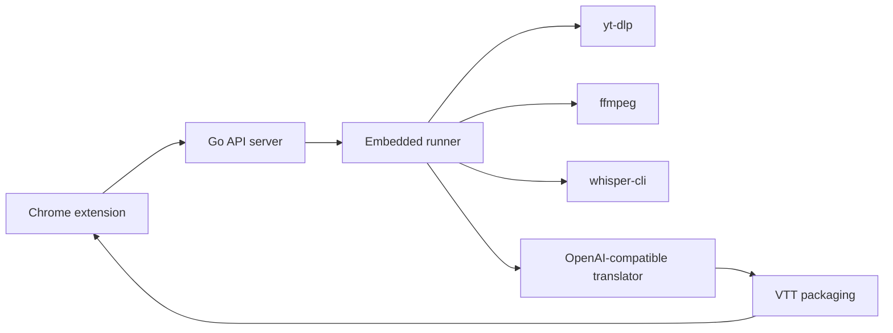

# Lets Sub It

<div align="center">

**自托管的 YouTube 字幕生成与翻译工具**

[功能](#功能) • [快速开始](#快速开始) • [API](#api) • [CLI](#cli) • [开发](#开发)

</div>

Lets Sub It 的目标是把“提交 YouTube 公开视频链接 -> 下载音频 -> 本地转写 -> 翻译 -> 生成字幕 -> 播放页加载”这条链路做得简单、可控、容易排障。

> [!NOTE]
> 项目仍处于 MVP 阶段。当前可运行部分包括 `backend/` 的 mock API server、`whisper/` 的本地 `faster-whisper` 转写 CLI，以及 `extension/` 的 Chrome MV3 前端工程。真实 `yt-dlp`、`ffmpeg`、`whisper-cli` runner 和 LLM 翻译仍在路线图中。

## 功能

- **自托管优先**：面向单用户本地部署，状态、字幕文件和中间产物保存在本机。
- **真实 API 边界**：Go backend 已提供 job 创建、状态查询、结果复用、SQLite 持久化和 VTT 文件服务。
- **可预测 mock runner**：当前 backend 不访问 YouTube 或 LLM，但会模拟完整阶段并写出 `source.vtt`、`translated.vtt`、`bilingual.vtt`。
- **本地转写 CLI**：`whisper-cli` 调用 `faster-whisper`，把本地音频文件转成经过校验的 WebVTT 字幕。
- **明确契约**：HTTP API、CLI 参数、JSON 输出和退出码都保持稳定，便于后续替换真实 runner。

## 架构



当前仓库已经实现：

- `backend/`：真实 HTTP API、SQLite、job 复用、mock 状态推进和字幕文件服务。
- `whisper/`：真实本地转写 CLI、WebVTT 渲染与校验。
- `extension/`：Chrome MV3 extension 工程，支持 popup 提交/轮询、background API 网关、storage 缓存和 YouTube watch 页面字幕层。

暂未实现：

- 真实 YouTube 下载、音频处理、后端调用 `whisper-cli`、LLM 翻译。

## 快速开始

### 准备工具链

项目使用 `mise.toml` 固定本地工具版本：

- Go `1.22`
- Python `3.12`
- Node `22`
- `uv`

```bash
mise install
```

> [!TIP]
> 如果你在没有自动激活 `mise` 的 shell 中运行命令，建议使用 `mise exec --` 前缀，下面的命令也按这个方式书写。

### 启动 mock API server

```bash
cd backend
mise exec -- go mod download
LSI_ADDR=127.0.0.1:8080 mise exec -- go run ./cmd/server
```

用另一个终端创建 job：

```bash
curl -X POST "http://127.0.0.1:8080/jobs" \
  -H "Content-Type: application/json" \
  -d '{
    "youtubeUrl": "https://www.youtube.com/watch?v=dQw4w9WgXcQ",
    "sourceLanguage": "ja",
    "targetLanguage": "zh-Hans"
  }'
```

创建后，mock runner 会推进状态并在本地工作目录写出三种 VTT 文件。

### 运行本地转写 CLI

```bash
cd whisper
mise exec -- uv sync --dev
mise exec -- uv run whisper-cli \
  --input /path/to/audio.mp3 \
  --output /tmp/source.vtt \
  --model small \
  --language ja
```

成功时 stdout 输出 JSON，`--output` 写入 WebVTT：

```json
{
  "output": "/tmp/source.vtt",
  "language": "ja",
  "duration_seconds": 123.45,
  "segments": 42
}
```

> [!IMPORTANT]
> 真实转写会触发 `faster-whisper` 推理，可能需要模型下载能力和本机可用的推理运行环境。单元测试使用 fake model，不依赖网络、模型下载或 GPU。

## API

当前 backend 暴露本地联调用的 mock API：

| 方法 | 路径 | 说明 |
| --- | --- | --- |
| `POST` | `/jobs` | 创建或复用字幕生成 job |
| `GET` | `/jobs/:id` | 查询 job 状态 |
| `GET` | `/subtitle-assets?videoId=...&targetLanguage=...` | 查询已完成字幕资产 |
| `GET` | `/subtitle-files/:jobId/:mode` | 读取 VTT 文件，`mode` 为 `source`、`translated` 或 `bilingual` |

主要配置：

| 环境变量 | 默认值 | 说明 |
| --- | --- | --- |
| `LSI_ADDR` | `127.0.0.1:8080` | HTTP 监听地址 |
| `LSI_DB_PATH` | `./data/backend.sqlite3` | SQLite 数据库路径 |
| `LSI_WORK_DIR` | `./data/jobs` | job 工作目录根路径 |

状态流转：

```text
queued -> downloading -> transcribing -> translating -> packaging -> completed
```

失败时状态为 `failed`，响应中的 `errorMessage` 会记录错误摘要。

## CLI

`whisper-cli` 的输入是本地音频文件，输出是合法 WebVTT。

```bash
whisper-cli \
  --input /path/to/audio.mp3 \
  --output /tmp/source.vtt \
  --model small \
  --language ja
```

| 参数 | 必填 | 说明 |
| --- | --- | --- |
| `--input` | 是 | 本地音频文件路径 |
| `--output` | 是 | 输出 `.vtt` 路径，不能与输入路径相同 |
| `--model` | 是 | `faster-whisper` 模型名，例如 `small` |
| `--language` | 是 | 转写语言代码，例如 `ja`、`en` |

退出码契约：

| 退出码 | 含义 |
| --- | --- |
| `0` | 成功 |
| `2` | 输入校验失败，例如文件不存在、模型名或语言无效 |
| `3` | 转写失败 |
| `4` | 输出校验失败，例如无法生成合法 VTT |

## 仓库结构

```text
.
├── backend/                 # Go mock API server
│   ├── cmd/server/          # HTTP server 入口
│   └── internal/            # API、store、runner、app 代码
├── docs/                    # PRD、规格和实施计划
├── extension/               # Chrome MV3 extension
├── whisper/                 # Python faster-whisper CLI
│   ├── src/whisper_cli/     # CLI、转写适配和 VTT 渲染
│   └── tests/               # pytest 单元测试
└── mise.toml                # 本地工具链版本
```

## 开发

运行后端测试：

```bash
cd backend
mise exec -- go test ./...
```

运行 Whisper CLI 测试：

```bash
cd whisper
mise exec -- uv run pytest
```

验证 Python 包构建：

```bash
cd whisper
mise exec -- uv build
```

## 路线图

- [x] 本地 `whisper-cli` 转写命令
- [x] WebVTT 渲染与基础校验
- [x] CLI 退出码和 JSON 输出契约
- [x] Go mock API server、SQLite、job 复用、状态机与字幕文件服务
- [ ] 真实 `yt-dlp` 下载与 `ffmpeg` 音频处理
- [ ] 后端 embedded runner 调用真实 `whisper-cli`
- [ ] OpenAI-compatible LLM 翻译链路
- [ ] 基于真实字幕的 `translated.vtt` 与 `bilingual.vtt` 打包
- [x] Chrome extension 任务提交、状态轮询和播放页字幕层

## 相关文档

- [PRD](docs/PRD.md)
- [Whisper CLI 设计说明](docs/superpowers/specs/2026-04-23-whisper-cli-design.md)
- [Backend Mock MVP 设计](docs/superpowers/specs/2026-04-24-backend-mock-mvp-design.md)
- [Backend README](backend/README.md)
- [Whisper README](whisper/README.md)
