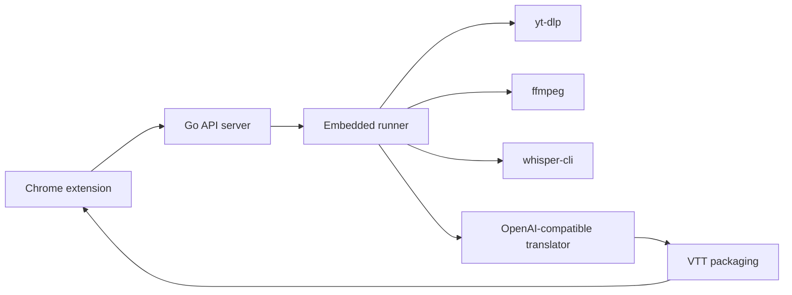

# Lets Sub It

自托管的 YouTube 字幕生成与翻译工具。目标是把“提交公开视频链接 → 下载音频 → 本地转写 → 翻译 → 生成字幕 → 播放页加载”这条链路做得简单、可控、容易排障。

> [!NOTE]
> 项目仍处于 MVP 建设阶段。当前已落地并可运行的部分是 `whisper/` 下的本地转写 CLI，用于把本地音频文件转成经过校验的 WebVTT 字幕。

## 功能亮点

- **本地优先**：转写通过本地 `faster-whisper` SDK 执行，后续服务端可通过 CLI 进程边界集成。
- **稳定契约**：CLI 使用固定参数、JSON 成功输出和明确退出码，便于 Go runner 或脚本调用。
- **WebVTT 校验**：生成字幕前校验时间轴、空文本、非法 cue 文本等基础规则。
- **面向自托管**：产品设计以单用户、本地服务、本地磁盘和可调试链路为核心。

## 当前仓库结构

```text
.
├── docs/                    # PRD、规格和实施计划
├── whisper/                 # Python 3.12 faster-whisper CLI
│   ├── src/whisper_cli/     # CLI、转写适配和 VTT 渲染
│   ├── tests/               # pytest 单元测试
│   ├── pyproject.toml       # Python 包配置
│   └── uv.lock              # uv 锁文件
├── backend/                 # 后续 Go 服务端预留目录
├── extension/               # 后续 Chrome extension 预留目录
└── mise.toml                # 本地工具链版本
```

## 架构方向



当前实现集中在 `whisper-cli`：它接收本地音频路径，调用 `faster-whisper`，并写出 `source.vtt`。

## 环境要求

- `mise`
- Python `3.12`
- `uv`
- 运行真实转写时需要本机具备 `faster-whisper` 所需的运行环境与模型下载能力

安装项目工具链：

```bash
mise install
```

同步 Python 依赖：

```bash
cd whisper
uv sync --dev
```

## 快速开始

准备一个本地音频文件，然后运行：

```bash
cd whisper
uv run whisper-cli \
  --input /path/to/audio.mp3 \
  --output /tmp/source.vtt \
  --model small \
  --language ja
```

成功时，命令会写出 WebVTT 文件，并在 stdout 输出 JSON：

```json
{
  "output": "/tmp/source.vtt",
  "language": "ja",
  "duration_seconds": 123.45,
  "segments": 42
}
```

## CLI 契约

| 退出码 | 含义 |
| --- | --- |
| `0` | 成功 |
| `2` | 输入校验失败，例如输入文件不存在、模型名或语言无效 |
| `3` | 转写失败 |
| `4` | 输出校验失败，例如无法生成合法 VTT |

主要参数：

| 参数 | 必填 | 说明 |
| --- | --- | --- |
| `--input` | 是 | 本地音频文件路径 |
| `--output` | 是 | 输出的 `.vtt` 文件路径，不能与输入路径相同 |
| `--model` | 是 | `faster-whisper` 模型名，例如 `small` |
| `--language` | 是 | 转写语言代码，例如 `ja`、`en` |

## 开发

运行全部测试：

```bash
cd whisper
uv run pytest
```

运行单个测试文件：

```bash
cd whisper
uv run pytest tests/test_vtt.py
```

验证包构建：

```bash
cd whisper
uv build
```

> [!TIP]
> 单元测试使用 fake model，不会下载或运行真实 Whisper 模型；真实转写行为请用本地音频文件手动验证。

## 路线图

- [x] 本地 `whisper-cli` 转写命令
- [x] WebVTT 渲染与基础校验
- [x] CLI 退出码和 JSON 输出契约
- [x] mock backend API、SQLite、job 复用、状态机与字幕文件服务
- [ ] 真实 Go API server 与 embedded runner
- [ ] 真实 `yt-dlp` / `ffmpeg` / `whisper-cli` / LLM 集成
- [ ] OpenAI-compatible 翻译链路
- [ ] `translated.vtt` 与 `bilingual.vtt` 打包
- [ ] Chrome extension 任务提交、状态轮询和播放页字幕层

## 相关文档

- `docs/PRD.md`：YouTube 字幕翻译 MVP 产品需求
- `docs/superpowers/specs/2026-04-23-whisper-cli-design.md`：Whisper CLI 设计说明
- `docs/superpowers/plans/2026-04-23-whisper-sdk-cli.md`：Whisper CLI 实施计划
- `AGENTS.md`：面向 AI coding agent 的仓库工作指南
