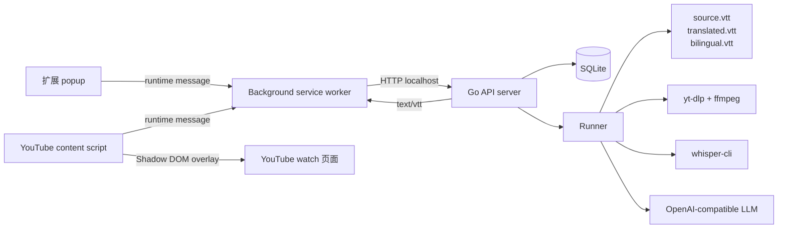

# 架构总览

Lets Sub It 按运行边界分成三个模块：`extension`、`Go API server with embedded runner` 和 `whisper-cli`。这个拆分让浏览器扩展只负责用户交互和 YouTube 页面集成，后端集中持有本地状态、文件和 provider 配置，转写能力则通过独立 CLI 保持可测试、可替换。

`extension` 里的 popup 和 content script 都不直接访问后端。它们通过 background service worker 发送 runtime message，由 background 统一调用本机 Go API，并把任务状态、字幕资产和 VTT 内容转交给 UI 或页面字幕层。

Go API server 同时承载 HTTP API、SQLite 持久化、job 生命周期和 embedded runner。SQLite 数据库和每个 job 的工作目录都保存在本地磁盘；工作目录包含下载后的音频、中间 `source.vtt` 以及最终 `translated.vtt`、`bilingual.vtt`。扩展只拿到后端提供的相对文件接口，不接触本地绝对路径。

Runner 负责跨出进程边界：用 `yt-dlp` 和 `ffmpeg` 下载并转码音频，用 `whisper-cli` 执行本地转写，再调用 OpenAI-compatible LLM 逐段翻译。这样浏览器端不会持有 provider key，也不会直接执行外部工具。

仓库目录和入口文件见 [仓库结构](../reference/repository-structure.md)。
