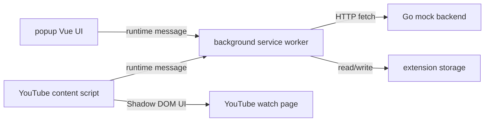

# Extension MVP 设计

## 背景

当前项目已经完成 `backend/` 的 mock API server。后端已经提供真实 HTTP API、SQLite 持久化、job 复用、mock runner 状态推进，以及 `source`、`translated`、`bilingual` 三种 VTT 字幕文件服务。`extension/` 目前只有 `.gitignore`，还没有可运行前端工程。

本设计定义 Chrome extension 第一版 MVP。目标是先基于 mock backend 打通前端提交、状态轮询、结果缓存和 YouTube 播放页字幕显示链路，不接入真实 YouTube 下载、真实转写或真实翻译。

## 目标

- 在 `extension/` 下建立 WXT extension 工程。
- 使用 `Vue + TypeScript + shadcn-vue` 实现 popup 和播放页注入 UI。
- 使用 WXT 自带 Vite 构建管线，不另起独立 Vite 项目。
- 使用 Vitest 覆盖可独立测试的业务模块。
- popup 支持配置 backend URL、提交 YouTube URL、选择源语言和目标语言、查看 job 状态。
- background service worker 作为唯一 HTTP API 网关，统一访问 Go backend。
- content script 只运行在 YouTube watch 页面，识别 `videoId`，恢复已完成字幕资产，并渲染字幕层。
- 支持 `translated` 和 `bilingual` 两种字幕模式切换。
- 使用 extension storage 保存设置、视频偏好和字幕资产缓存。

## 非目标

- 不支持 Firefox、Edge、Safari 或其他浏览器。
- 不支持 YouTube Shorts 页面。
- 不在播放页创建新 job，第一版只在 popup 创建任务。
- 不做字号、位置、透明度、拖拽、字幕编辑或字幕分享。
- 不支持完整语言列表，第一版只支持 `en` 和 `zh-CN` 互相转换。
- 不引入用户登录、鉴权、云同步或多用户能力。
- 不把翻译 provider 密钥保存在 extension 里。
- 不新增真实下载、真实转写或真实翻译能力。

## 已确认决策

- 技术栈使用 `WXT + Vue + TypeScript + Vite + Vitest + shadcn-vue`。
- 包管理器使用 `npm`。
- Node 22 由仓库根目录 `mise.toml` 管理。
- 第一版只面向 Chrome Manifest V3。
- 第一版只匹配 `https://www.youtube.com/watch*`。
- backend URL 在 popup 中可配置，默认值为 `http://127.0.0.1:8080`。
- background service worker 是唯一 HTTP API 网关。
- source language 默认 `en`。
- target language 默认 `zh-CN`。
- 支持语言固定为 `en` 和 `zh-CN`。
- `sourceLanguage` 和 `targetLanguage` 不能相同。
- 播放页第一版只做字幕显示、开关和 `translated/bilingual` 切换。
- 播放页恢复逻辑为本地缓存优先；缓存缺失时按上次目标语言查询 backend 的 `/subtitle-assets`。

## 技术选型

### WXT

WXT 负责 Manifest V3、entrypoints、TypeScript、Vite 构建和开发服务器。第一版不直接维护独立 Vite 应用，避免 extension 工程和普通 web 工程之间产生重复配置。

WXT entrypoints 对应本项目的三个入口：

- `popup`：浏览器 action popup。
- `background`：Manifest V3 service worker。
- `youtube.content`：YouTube watch 页面 content script。

### Vue 和 shadcn-vue

Vue 用于 popup 和播放页注入 UI。播放页 UI 通过 Shadow DOM 挂载，减少 YouTube 页面 CSS 对 extension UI 的影响。

shadcn-vue 只引入第一版实际需要的组件。初始组件范围：

- `button`
- `input`
- `select`
- `card`
- `alert`
- `badge`
- `separator`

不提前添加未使用组件，避免 UI 依赖和样式膨胀。

### Vitest

Vitest 用于单元测试。测试重点放在可独立验证的业务模块：

- YouTube `videoId` 解析。
- WebVTT 解析。
- 按播放时间选择当前 cue。
- storage 默认值和更新逻辑。
- background 消息 handler 的输入校验和错误转换。

WXT 的 Vitest plugin 和 fake browser 用于测试 extension storage，不手写大段 browser API mock。

### npm 和 mise

根目录 `mise.toml` 增加 Node 工具链版本，使用 Node 22。WXT runner 需要支持 `WebSocket` 标准的 JavaScript runtime，Node 22 系列满足这个要求。`extension/` 使用 `package.json` 和 `package-lock.json` 锁定 npm 依赖。

开发命令通过 `mise exec -- npm ...` 运行，例如：

```bash
cd extension
mise exec -- node --version
mise exec -- npm install
mise exec -- npm run dev
mise exec -- npm run test
mise exec -- npm run build
```

## 项目结构

```text
extension/
  package.json
  package-lock.json
  tsconfig.json
  vitest.config.ts
  wxt.config.ts
  components.json
  entrypoints/
    background.ts
    youtube.content.ts
    popup/
      index.html
      main.ts
      App.vue
  src/
    api/
      backend-client.ts
      messages.ts
    components/
      ui/
    popup/
      use-job-polling.ts
    storage/
      settings.ts
      subtitle-cache.ts
    subtitles/
      active-cue.ts
      vtt.ts
    youtube/
      page-watch.ts
      video-id.ts
```

目录职责：

- `entrypoints/`：WXT 入口文件，只放启动和挂载逻辑。
- `src/api/`：background 消息协议和 Go backend HTTP client。
- `src/storage/`：WXT storage key、默认值、缓存读写。
- `src/subtitles/`：VTT 解析和 cue 命中逻辑，不依赖 extension API。
- `src/youtube/`：YouTube watch URL、SPA 页面变化和 `<video>` 查找。
- `src/components/ui/`：shadcn-vue 生成的本地组件源码。
- `src/popup/`：popup 相关 composable。

## Manifest 权限

权限保持最小：

```text
permissions:
  - storage
  - activeTab

host_permissions:
  - http://127.0.0.1:*/*
  - http://localhost:*/*

content_scripts matches:
  - https://www.youtube.com/watch*
```

第一版只允许本机 backend 地址。popup 可以配置 `localhost` 或 `127.0.0.1` 的不同端口，但不支持任意远程主机。这样权限提示更收敛，也符合当前自托管本地联调阶段。`activeTab` 用于用户打开 popup 时读取当前活动标签页 URL，便于预填 YouTube 地址，不使用持久的 `tabs` 权限。

## 架构边界



### popup

popup 负责用户操作：

- 读取并保存 backend URL。
- 读取并保存上次使用的源语言和目标语言。
- 预填当前 active tab 的 YouTube URL。
- 手动输入 YouTube URL。
- 创建或复用 job。
- 轮询 job 状态。
- 展示阶段、进度文本、已耗时和错误信息。

popup 不直接请求 Go backend。所有网络请求都通过 runtime message 发给 background。

### background

background 是唯一 HTTP API 网关：

- 读取 storage 中的 backend URL。
- 调用 `POST /jobs`。
- 调用 `GET /jobs/:id`。
- 调用 `GET /subtitle-assets`。
- 调用 `GET /subtitle-files/:jobId/:mode`。
- 把 backend 错误和网络错误转换成统一错误结构。
- 写入 settings、video preferences 和 subtitle assets 缓存。

这个边界让 popup 和 content script 不需要各自维护 fetch、URL 拼接、错误解析和缓存写入逻辑。

### content script

content script 负责 YouTube 页面集成：

- 只在 YouTube watch 页面运行。
- 从当前 URL 识别 `videoId`。
- 监听 YouTube SPA 导航导致的 `videoId` 变化。
- 查找页面中的 `<video>` 元素。
- 通过 Shadow DOM 挂载字幕控制条和字幕层。
- 向 background 查询可用字幕资产。
- 向 background 获取 VTT 文本。
- 在本地解析 VTT，并根据 `<video>.currentTime` 显示当前 cue。

content script 不直接访问 Go backend，也不创建 job。

## 后端 API 契约

extension 第一版依赖现有 backend mock API：

```text
POST /jobs
GET /jobs/:id
GET /subtitle-assets?videoId=...&targetLanguage=...
GET /subtitle-files/:jobId/:mode
```

`mode` 在播放页只使用：

- `translated`
- `bilingual`

`source` 文件可以保留在缓存结构中，但第一版 UI 不提供 source 字幕模式。

## 用户流程

### popup 创建任务

1. popup 启动时读取 settings。
2. 如果当前 active tab 是 YouTube watch 页面，预填当前 URL。
3. 用户确认 backend URL、YouTube URL、源语言和目标语言。
4. popup 校验 `sourceLanguage !== targetLanguage`。
5. popup 发送 `job:create` 消息给 background。
6. background 调用 `POST /jobs`。
7. popup 使用 `job:get` 每 1000ms 轮询 job 状态。
8. job 进入 `completed` 后，background 查询 `/subtitle-assets`。
9. background 写入 subtitle asset 缓存和 video preference。
10. popup 显示完成状态。

轮询在 `completed` 或 `failed` 时停止。`progressText` 只作为展示文本，不做业务解析。

### 播放页恢复字幕

1. content script 识别当前 `videoId`。
2. content script 发送 `subtitle:resolve` 给 background。
3. background 先查本地 subtitle asset 缓存。
4. 缓存命中时直接返回资产。
5. 缓存缺失时，background 使用 storage 中上次目标语言查询 `/subtitle-assets`。
6. 如果 backend 返回资产，background 写入缓存并返回。
7. content script 用当前 `selectedMode` 请求 `subtitle:fetch-file`。
8. background 拉取 VTT 文本并返回。
9. content script 解析 VTT cues。
10. content script 根据视频当前时间更新字幕显示。

如果没有资产，播放页保持轻量空状态，不弹出阻断式提示。

## UI 范围

### popup

popup 是紧凑工具面板，不做营销页或说明页。

字段：

- backend URL 输入框。
- YouTube URL 输入框。
- source language 选择。
- target language 选择。
- 创建或复用任务按钮。

状态区：

- 当前 job 状态。
- `progressText`。
- `transcribing` 已耗时。
- `failed` 错误信息。
- `completed` 缓存完成提示。

语言选择：

```text
支持语言：en, zh-CN
sourceLanguage 默认：en
targetLanguage 默认：zh-CN
约束：sourceLanguage != targetLanguage
```

### 播放页

播放页 UI 通过 Shadow DOM 注入：

- 字幕开关。
- `translated/bilingual` 分段切换。
- 轻量状态文本。
- 字幕显示层。

字幕层按 VTT cue 文本原样显示。`bilingual` 模式不拆分双语文本，只展示 `bilingual.vtt` 中的 cue 文本。

第一版不做显示样式配置。

## 存储模型

### Settings

```ts
type Settings = {
  backendBaseUrl: string
  sourceLanguage: "en" | "zh-CN"
  targetLanguage: "en" | "zh-CN"
}
```

默认值：

```ts
{
  backendBaseUrl: "http://127.0.0.1:8080",
  sourceLanguage: "en",
  targetLanguage: "zh-CN"
}
```

### VideoPreference

```ts
type VideoPreference = {
  videoId: string
  targetLanguage: "en" | "zh-CN"
  selectedMode: "translated" | "bilingual"
}
```

### SubtitleAssetCacheEntry

```ts
type SubtitleAssetCacheEntry = {
  videoId: string
  targetLanguage: "en" | "zh-CN"
  sourceLanguage: "en" | "zh-CN"
  jobId: string
  files: {
    source: string
    translated: string
    bilingual: string
  }
  selectedMode: "translated" | "bilingual"
  lastSyncedAt: string
}
```

缓存 key 使用：

```text
subtitleAssets:${videoId}:${targetLanguage}
```

video preference key 使用：

```text
videoPreferences:${videoId}
```

## 消息协议

第一版使用少量明确消息：

```ts
type ExtensionMessage =
  | { type: "settings:get" }
  | { type: "settings:update"; payload: Partial<Settings> }
  | { type: "job:create"; payload: CreateJobInput }
  | { type: "job:get"; payload: { jobId: string } }
  | { type: "subtitle:resolve"; payload: { videoId: string } }
  | {
      type: "subtitle:fetch-file"
      payload: { jobId: string; mode: "translated" | "bilingual" }
    }
  | {
      type: "subtitle:update-mode"
      payload: {
        videoId: string
        targetLanguage: "en" | "zh-CN"
        mode: "translated" | "bilingual"
      }
    }
```

统一返回结构：

```ts
type MessageResult<T> =
  | { ok: true; data: T }
  | { ok: false; error: { code: string; message: string } }
```

`job:create` 在 background 再做一次 `sourceLanguage !== targetLanguage` 校验，避免 popup UI 漏校验时请求 backend。

## WebVTT 处理

第一版只实现项目需要的最小 VTT 解析：

- 跳过 `WEBVTT` 文件头。
- 解析 `HH:MM:SS.mmm --> HH:MM:SS.mmm` 时间行。
- 支持 cue 文本多行。
- 保留 cue 文本中的换行。
- 忽略空行。
- 不支持复杂 cue setting、region、style 或 note。

当前 cue 选择规则：

```text
cue.start <= currentTime < cue.end
```

没有命中 cue 时返回空文本。

## 错误处理

错误统一成：

```ts
{
  code: string
  message: string
}
```

popup 可见错误：

- backend URL 不合法。
- YouTube URL 缺失或不支持。
- source language 和 target language 相同。
- backend 网络失败。
- backend 返回错误。
- job failed，并显示 `errorMessage`。

content script 可见错误保持轻量：

- 没有找到字幕资产。
- 字幕文件加载失败。
- 字幕解析失败。

更详细的技术错误写入 console，避免干扰用户观看视频。

## 安全与隐私

- extension 不保存 OpenAI-compatible API key。
- extension 不处理私有视频、登录态或鉴权绕过。
- host permissions 第一版只覆盖 `localhost` 和 `127.0.0.1`。
- content script 不直接请求 backend，减少页面上下文相关的跨域和权限边界问题。
- API 响应不暴露本地字幕文件绝对路径，字幕文件通过 backend 的 `/subtitle-files/:jobId/:mode` 获取。

## 测试策略

### 单元测试

优先覆盖稳定业务契约：

- `youtube/video-id.ts`
  - 支持 YouTube watch URL。
  - 非 watch URL 返回空。
- `subtitles/vtt.ts`
  - 解析合法 VTT。
  - 支持多行 cue 文本。
  - 拒绝没有 cue 的 VTT。
- `subtitles/active-cue.ts`
  - 当前时间命中 cue。
  - cue 结束边界不命中。
  - 无命中时返回空。
- `storage/settings.ts`
  - 读取默认 settings。
  - 更新 backend URL。
  - 更新语言选择。
- `storage/subtitle-cache.ts`
  - 写入和读取 asset。
  - 更新 selected mode。
  - 按 `videoId + targetLanguage` 区分缓存。
- background handler
  - 同语言创建 job 被拒绝。
  - backend 错误转换为统一错误。

### 构建验证

第一版实现完成后至少运行：

```bash
cd extension
mise exec -- npm run test
mise exec -- npm run build
```

如果改动根目录工具链配置，还需要确认：

```bash
mise exec -- node --version
```

### 手动联调

手动联调步骤：

1. 启动 backend mock server。
2. 启动 WXT dev server。
3. 在 Chrome 加载 extension。
4. 打开 YouTube watch 页面。
5. 在 popup 创建 job。
6. 等待 mock job completed。
7. 刷新同一视频页面。
8. 验证字幕控制条出现。
9. 验证 `translated` 和 `bilingual` 模式可切换。

## 后续迭代

- 支持更多语言。
- 支持播放页直接触发创建 job。
- 支持用户配置字幕字号、位置和背景。
- 支持更完整的 YouTube SPA 路由监听。
- 支持 optional host permissions，以便连接非本机 backend。
- 增加 Playwright 或浏览器级集成测试。
- 接入真实 runner 后补充更细的错误提示。

## 参考

- Chrome Extensions 文档：跨域请求建议由 extension 侧发起，并通过 host permissions 控制访问范围。
- WXT 文档：使用 entrypoints 定义 popup、background 和 content script，并支持 content script Shadow DOM UI。
- shadcn-vue 文档：组件以源码形式加入 Vue 3 + TypeScript 项目。
- Vitest 和 WXT 文档：使用 WXT Vitest plugin 和 fake browser 测试 extension storage。
